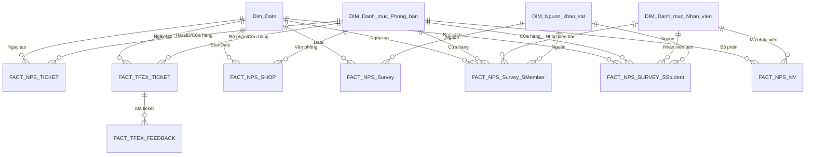

# CS_Kết quả khảo sát CS | Power BI

Customer Experience, NPS, CS Operations, Reward & Penalty Dashboard

Author: Lê Trường Quyết  
Date: 2026-05-11  
Tools used: Power BI, BigQuery, Google Sheets

This case-study style documentation is based on the Power BI Desktop report currently open: `CS_Kết quả khảo sát CS.pbix`.

---

## Table of Contents

1. [Background & Overview](#background--overview)
2. [Dataset Description & Data Structure](#dataset-description--data-structure)
3. [Design Thinking Process](#design-thinking-process)
4. [Key Insights & Visualizations](#key-insights--visualizations)
5. [Final Conclusion & Recommendations](#final-conclusion--recommendations)
6. [Technical Appendix](#technical-appendix)

---

## Background & Overview

### Objective

### What is this project about?

This project builds a Power BI dashboard to monitor CS survey results, NPS performance, customer feedback, TFEX tickets, violation quality, and reward/penalty outcomes across CellphoneS stores and employees.

The dashboard combines survey, ticket, attendance, store hierarchy, target, warning, QC AI, and reward framework data to help stakeholders understand:

- Overall customer satisfaction and NPS by shop, region, AM/RSM, size shop, and month.
- Whether stores and employees meet NPS target and service consultation requirements.
- Which stores, employees, ticket types, and violation groups need follow-up.
- How Smember and Học sinh - Sinh viên consultation performance differs by region/shop/employee.
- Which stores/employees qualify for reward or penalty based on business logic.

### Who is this project for?

- CS managers and operators tracking service quality and survey outcomes.
- Store operation teams, AM, RSM, SM/SUP, and shop managers monitoring performance by region/store.
- Business analysts and data analysts validating NPS logic, data lineage, and measure behavior.
- Reward/penalty stakeholders reviewing shop and employee performance.
- Power BI maintainers responsible for refresh, RLS, data model, and report governance.

### Business Questions

- What is the current NPS performance versus target?
- Which regions and stores contribute the most survey volume and satisfaction results?
- Which stores have high volume but weaker NPS, and should be prioritized?
- What are the main violation groups: Nghiệp vụ, Thái độ, or BHMR?
- What is the survey coverage by channel such as Khảo sát and SMS?
- Are Smember and Học sinh - Sinh viên consultation requirements being followed?
- Which shops/employees are rewarded or penalized, and why?
- Are there data quality or governance risks that could affect interpretation?

---

## Dataset Description & Data Structure

### Data Source

- Source platforms: BigQuery, Google Sheets published xlsx, Power BI calculated tables.
- Report file: `C:\Users\S16112\Downloads\CS_Kết quả khảo sát CS.pbix`
- Power BI service metadata:
  - Workspace object id: `0c1a767d-1691-4e9d-8f98-bd4f4235b799`
  - Report id: `d77bf887-527e-4ae2-bf79-1810686e5a7d`
  - Dataset id: `eb5949e2-9f3b-4769-8b07-7bb461cc0a15`
- Inferred report link: `https://app.powerbi.com/groups/0c1a767d-1691-4e9d-8f98-bd4f4235b799/reports/d77bf887-527e-4ae2-bf79-1810686e5a7d`
- Model size: 81 tables, 885 columns, 92 measures, 90 relationships, 161 visuals across 15 pages.
- Refresh note from model table `Ghi chú`: starts at 5h30, 13h, 16h, 19h, 21h; latest data is expected at refresh time minus 1 hour.

### Tables Used

The report is built from these main table groups:

- `FACT_NPS_TICKET`: core customer survey tickets from BigQuery.
- `FACT_TFEX_TICKET`: TFEX complaint/evaluation tickets, enriched by latest responsible department activity.
- `FACT_TFEX_FEEDBACK`: latest feedback per TFEX ticket.
- `FACT_QC_AI`: QC AI call logs joined with sales transaction and shop line information.
- `FACT_Công_ChiTiet`: attendance/working-day base used to build shop and employee reporting entities.
- `FACT_GSheet_Target_NPS`: NPS target by region/object/date from Google Sheets.
- `FACT_GSheet_KhungThuong`: reward framework by region/size shop/effective month from Google Sheets.
- `DIM_Danh mục_Phòng ban`: store/department hierarchy: region, RSM, AM, store, type, size.
- `DIM_Danh mục_Nhân viên`: employee master and mapping fields.
- `DIM_Phân quyền_User` and `DIM_Phân quyền_Vận hành`: user-to-store access control for RLS.
- Calculated tables such as `FACT_NPS_SHOP`, `FACT_NPS_NV`, `FACT_NPS_Survey`, `FACT_NPS_Survey_SMember`, `FACT_NPS_SURVEY_SStudent`, `FACT_TFEX_SHOP`, `NPS_Detail_Evaluation`, `Rank_Survey_SMember`, and `Rank_Survey_SStudent`.

### Data Snapshot

| Table | Grain | Loaded rows | Current data window / key logic |
|---|---:|---:|---|
| `FACT_NPS_TICKET` | Survey/ticket/order level | 2,366,062 | `ngay_tao_phieu` from 2025-10-01 to 2026-05-10; excludes source `Tại Cửa Hàng` |
| `FACT_TFEX_TICKET` | TFEX ticket level | 20,069 | `Tạo lúc` from 2025-12-01 to 2026-05-10; filters shop/XLKN/manager-call/reward labels |
| `FACT_TFEX_FEEDBACK` | Latest feedback per ticket | 1,934 | Latest row per ticket in the last 1 month |
| `FACT_QC_AI` | QC call/order/metric level | 18,613 | Last 2 months, joined by phone, line, shop, and order date |
| `FACT_Công_ChiTiet` | Employee/date/shift | 148,277 | Last 2 months, approved attendance, `S*` employees, CPS non-PG |
| `FACT_NPS_SHOP` | Shop/month | 491 | Built from attendance base; excludes B2B/online special stores |
| `FACT_NPS_NV` | Employee/month | 8,970 | Built from attendance base |
| `FACT_NPS_Survey` | Survey detail | 2,259,556 | Derived from NPS tickets for selected sales methods |
| `FACT_NPS_Survey_SMember` | Smember survey detail | 110,447 | NPS ticket survey union QC AI |
| `FACT_NPS_SURVEY_SStudent` | SStudent survey detail | 69,843 | Student-policy survey from 2026-01-01 |
| `NPS_Detail_Evaluation` | NPS/ticket detail | 300,711 | Union of TFEX and NPS evaluation detail |

### Data Structure & Relationships

The semantic model is centered around survey/ticket facts connected to date, store hierarchy, employee hierarchy, source, and permission dimensions.

### Dataset Caveats

- Data windows differ by table: NPS ticket 7 months, TFEX ticket 5 months, feedback 1 month, QC AI/sales/attendance 2 months.
- `FACT_SALES_TICKET` currently loads 0 rows in the inspected model.
- Several store-code replacements and exclusions are hard-coded in Power Query.
- Google Sheets dependencies must keep stable sheet names and column headers.
- RLS depends on correct mappings in `DIM_Phân quyền_User`.

---

## Key Insights & Visualizations

### Dashboard Preview 1: Executive NPS Overview

Main page: `NPS_SHOP`

Visuals included:

- KPI card group: store count, NPS, Hài lòng, Bình thường, Không hài lòng, Nhắc nhở, Vi phạm, Tổng số phiếu.
- Donut chart: stores đạt/không đạt.
- Matrix: NPS by month, region, RSM, AM, store, size shop, and metric parameter.
- Matrix: NPS Shop with detailed violation grouping.
- Date/month, region, AM, store, size, and metric slicers.

### Key Findings

1. Overall NPS is above target.
   - Current `NPS_Shop`: 94.98%.
   - Current `Target NPS`: 94.00%.
   - `%Target NPS`: 101.04%.

2. Survey result mix is strongly positive, but violation and normal feedback still drive improvement opportunities.
   - Total survey base: 300,712.
   - Hài lòng: 287,854.
   - Bình thường: 9,588.
   - Không hài lòng: 756.
   - Vi phạm: 2,231.
   - Nhắc nhở: 283.

3. Regional performance is close, but volume is concentrated in Miền Nam.
   - Miền Nam: 185,927 surveys, NPS 95.42%, violation tickets 1,041.
   - Miền Bắc: 113,984 surveys, NPS 94.94%, violation tickets 811.
   - Blank/unmapped region: 801 surveys, NPS -0.87%, violation tickets 379.

4. High-volume stores with strong NPS can be used as benchmarks.
   - `CPS-HCM-Q06-1075BHG`: 6,450 surveys, NPS 98.03%.
   - `CPS-HCM-Q10-288BTH`: 5,302 surveys, NPS 95.15%.
   - `CPS-HNO-DDA-133TH`: 4,838 surveys, NPS 94.05%.
   - `CPS-HNO-CGI-310CG`: 4,629 surveys, NPS 94.45%.

5. Lower-NPS stores with enough volume should be prioritized.
   - `CPS-HNO-TXU-543NT`: 2,636 surveys, NPS 91.88%.
   - `CPS-HCM-Q07-571HTP`: 1,951 surveys, NPS 92.06%.
   - `CPS-HCM-Q01-220TQK`: 2,084 surveys, NPS 92.18%.
   - `CPS-HNO-AKH-42A10LTT`: 1,249 surveys, NPS 92.55%.

### Dashboard Preview 2: Violation & Ticket Detail

Main pages: `Chi tiết NPS`, `Chi tiết Vi Phạm`, `Chi tiết Phản Hồi`

Visuals included:

- Ticket detail table by survey id, ticket id, source, date, status, classification, store, employee, AM/RSM, label, method.
- Donut charts by violation status, ticket result, and method.
- Pivots for violation rate, normal-feedback method analysis, and top violation stores.
- Text filters for survey id and ticket id.

### Key Findings

1. Most violation tickets belong to process/professional handling rather than other groups.
   - `Nghiệp vụ`: 1,502 tickets.
   - `Thái độ`: 567 tickets.
   - `BHMR`: 28 tickets.

2. The quickest operational lift is likely from fixing high-volume `Nghiệp vụ` issues first.
   - Suggested focus: process adherence, consultation accuracy, order handling, and handoff quality.

3. `Thái độ` remains meaningful and should be handled as a training/behavior topic.
   - Suggested focus: staff attitude, greeting/closing, empathy, and escalation language.

4. Unmapped region/store data is a data quality risk.
   - The blank region group has low/negative NPS and 379 violations, which can distort executive views if not fixed.

### Dashboard Preview 3: Survey Coverage

Main page: `Kết quả khảo sát`

Visuals included:

- Pivot overview: AM, total survey rate, SMS/ZNS surveyed, SMS/ZNS survey rate, HappyCall surveyed, HappyCall survey rate, total sales tickets, surveyed, not surveyed.
- Detail table: source, survey id, status, latest survey date, surveyed flag, store, invoice, purchase date, method, customer phone, survey duration.

### Key Findings

1. Overall survey coverage is still limited relative to total order volume.
   - `Tỷ lệ khảo sát`: 14.46%.

2. Survey volume by source is uneven.
   - `Khảo sát`: 2,146,585 orders, 213,869 surveyed, survey rate 9.96%.
   - `SMS`: 112,971 orders, 112,971 surveyed, survey rate 100.00%.

3. The SMS source should be interpreted carefully.
   - A 100% rate may mean the source table is already filtered to SMS-surveyed population rather than all eligible SMS contacts.

4. Increasing coverage in the large `Khảo sát` base should have the biggest impact on reliability.

### Dashboard Preview 4: Smember & SStudent Consultation

Main pages: `Kết quả khảo sát_Smember`, `Chi tiết Nhân viên_Smember`, `Kết quả khảo sát_SStudent`, `Chi tiết Nhân viên_SStudent`

Visuals included:

- Consultation overview by region/store.
- Employee-level consultation matrix.
- Survey detail tables with source, survey id, result, store, invoice, purchase date, method, customer phone, duration.
- Ranking and penalty pages for shop and employee.

### Key Findings

1. Smember consultation performance is solid overall, but region gap is visible.
   - Overall `Tỷ lệ có tư vấn`: 86.00%.
   - Miền Nam: 58,443 total Smember consultation surveys, 88.17% consulted.
   - Miền Bắc: 35,341 total Smember consultation surveys, 82.41% consulted.

2. SStudent consultation performance is slightly higher overall, with a similar regional gap.
   - Overall `Tỷ lệ có tư vấn SStudent`: 87.03%.
   - Miền Nam: 44,569 total SStudent surveys, 90.24% consulted.
   - Miền Bắc: 25,182 total SStudent surveys, 81.34% consulted.

3. Miền Bắc should be the first region for consultation improvement.
   - Gap versus Miền Nam is about 5.76 percentage points for Smember and 8.90 percentage points for SStudent.

4. Employee-level pages are important because shop averages can hide concentrated non-consultation behavior.

### Dashboard Preview 5: Reward & Penalty

Main pages: `Thưởng_SHOP`, `Thưởng Phạt_Nhân viên`, `Xếp hạng và Thưởng phạt_Smember`, `Xếp hạng và Thưởng phạt_SStudent`

Visuals included:

- Shop ranking table by month, region, AM, store, size, survey count, consultation count, target, assessment, ranking, reward/penalty.
- Employee penalty table by AM, store, employee code, employee name, non-consultation count, penalty amount.
- Scatter and chart views for satisfaction, violation, and size shop analysis.

### Key Findings

1. Reward/penalty logic depends on clean target, shop size, and month context.

2. The report already supports operational drill-down from region to shop to employee.

3. `Phạt tư vấn_NV` has a hard-coded July 2025 rule.
   - This should be reviewed periodically because policy changes can silently make historical logic outdated.

4. The zero-row `FACT_SALES_TICKET` should be investigated before relying on sales-ticket-based consultation metrics.

---

## Final Conclusion & Recommendations

### Conclusion

The `CS_Kết quả khảo sát CS` dashboard is a strong operational report for monitoring NPS, survey coverage, service consultation, TFEX violations, and reward/penalty outcomes. The current NPS is above target, but the report also reveals clear improvement areas: unmapped data quality, limited survey coverage, Nghiệp vụ violations, and lower consultation rates in Miền Bắc.

### Recommendations

1. Fix unmapped region/store records first.
   - Blank region currently has 801 surveys and 379 violations, creating a major distortion risk.

2. Prioritize `Nghiệp vụ` violation reduction.
   - This group has 1,502 violation tickets, far above Thái độ and BHMR.

3. Improve consultation execution in Miền Bắc.
   - Smember consulted rate is 82.41% in Miền Bắc versus 88.17% in Miền Nam.
   - SStudent consulted rate is 81.34% in Miền Bắc versus 90.24% in Miền Nam.

4. Increase survey coverage in the largest source population.
   - Overall survey rate is 14.46%; `Khảo sát` source rate is 9.96%.

5. Validate `FACT_SALES_TICKET`.
   - The table currently returns 0 rows, so any metric depending on it should be reviewed.

6. Formalize governance.
   - Confirm report owner, business owner, official app/report link, and policy owners for target/reward/penalty.

7. Review hard-coded business logic.
   - Store-code replacements, shop exclusions, and `Phạt tư vấn_NV` month logic should be documented with business rationale.

### Action Priority

| Priority | Action | Owner suggestion | Expected impact |
|---:|---|---|---|
| 1 | Fix blank/unmapped store and region mappings | Data/BI owner | More reliable NPS and violation reporting |
| 2 | Investigate `FACT_SALES_TICKET` zero rows | BI/data engineer | Prevent silent errors in consultation/sales logic |
| 3 | Build action plan for `Nghiệp vụ` violations | CS operations | Reduce biggest violation bucket |
| 4 | Improve Miền Bắc Smember/SStudent consultation | AM/RSM/CS operations | Close regional service execution gap |
| 5 | Confirm owner, official link, and refresh SLA | Report owner | Better report governance |

---

## Technical Appendix

### Key Measures

| Measure | Definition / logic | Business usage |
|---|---|---|
| `NPS_Shop` | `(Hài lòng - Vi phạm) / Tổng khảo sát` | Core shop NPS |
| `Tổng khảo sát` | Hài lòng + Bình thường + Không hài lòng + Vi phạm + Nhắc nhở | Survey denominator |
| `Số phiếu Hài lòng` | `Số phiếu Hài lòng_NoTicket + Số phiếu Hài lòng_HaveTicket` | Positive survey volume |
| `Số phiếu Vi phạm_HaveTicket` | Distinct count TFEX ticket where `Kết luận = "Có vi phạm"` | Violation volume |
| `Target NPS` | Average target from Google Sheet where `Đối tượng = "NPS"` | Target comparison |
| `%Target NPS` | `NPS_Shop / Target NPS` | Target completion |
| `Tỷ lệ khảo sát` | Surveyed orders / total orders | Survey coverage |
| `Tỷ lệ có tư vấn` | Consulted survey count / consultation survey count | Smember compliance |
| `Tỷ lệ có tư vấn SStudent` | SStudent consulted count / SStudent survey count | Student policy compliance |
| `Ngày cập nhật` | Max latest survey date from `Update` table | Data freshness card |

### Field Parameters

- `Parameter`: Miền, AM, Cửa hàng, Size shop.
- `Parameter_new`: Miền, RSM, AM, Cửa hàng, Size shop.
- `Parameter_Thời gian`: Ngày, Tuần, Tháng.
- `Parameter_Metrics_NPSShop`: SM/SUP, Size shop, NPS, %Target NPS, Target, Đánh giá, Tổng số phiếu, Hài lòng, Bình thường, Không hài lòng, Nhắc nhở, Vi phạm, %Vi phạm, Chi tiết Vi phạm.
- `Parameter_SMB`: number of consulted/non-consulted surveys by SMS and HappyCall.

### Report-Level Filters

- `Dim_Date[IsActive] = 1`
- `DIM_Danh mục_Phòng ban[Type] = "Cửa Hàng"`
- `DIM_Danh mục_Phòng ban[Cửa hàng gộp]` does not contain `B2B`

### RLS

Roles detected:

- `Vận hành_Cửa hàng`
- `Vận hành_OP`
- `Vận hành_AM`

RLS filters are applied on `DIM_Phân quyền_Vận hành` using `USERPRINCIPALNAME()` and mappings from `DIM_Phân quyền_User`.

### Exported Inspection Files

- `C:\Users\S16112\.codex\tmp\cs_kqs_inspection\model_metadata.json`
- `C:\Users\S16112\.codex\tmp\cs_kqs_inspection\pages_summary.csv`
- `C:\Users\S16112\.codex\tmp\cs_kqs_inspection\visuals_summary.csv`
- `C:\Users\S16112\.codex\tmp\cs_kqs_inspection\measures_inventory.csv`

